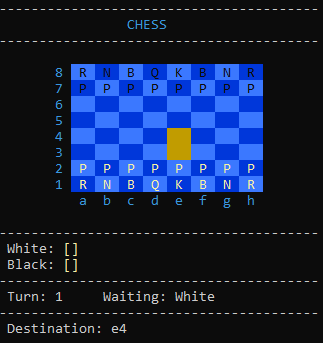
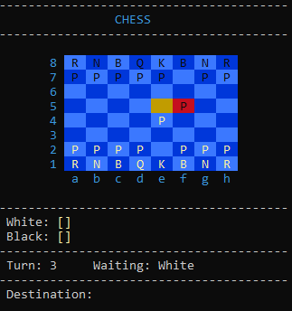

# Console Chess Game

This project is a simple chess game implemented in C#. The game runs in the console, allowing two players to compete by entering moves using standard chess notation.

## Features

- **Console-Based Interface**: Play chess directly in your console.
- **Move Validation**: Ensures that all moves follow the rules of chess.
- **Check and Checkmate Detection**: Alerts players when they are in check or checkmate.
- **Captured Pieces Display**: Keeps track of and displays pieces that have been captured.
- **Turn Management**: Handles alternating turns between the two players.

## Screenshots
<div align="center">
  
  
</div>

## Getting Started

### Prerequisites

- .NET SDK installed on your machine.

### Installation

1. Clone the repository:
  ```bash
  git clone git@github.com:MateusjsSilva/console-chess.git
  ```
2. Navigate to the project directory:
  ```bash
  cd console-chess
  ```
3. Build and run the application:
  ```bash
  dotnet run
  ```

## How to Play
1. **Start the Game:** The game will start in the console window.

2. **Input Your Moves:** Follow the prompts to make your moves. Moves are entered in the format of a chess position (e.g., e2 for the starting position of a pawn).

## Gameplay
### Making Moves
- **Input Format:** Moves are specified using chess notation. Enter the source and destination positions in the format e2 (column and row).

- **Example:** To move a piece from e2 to e4, input e2 as the origin and e4 as the destination when prompted.

### Game Status
- **Turn Information:** Displays the current turn and the player who is to make the next move.

- **Check and Checkmate:** If a player's king is under threat, the game will display a "CHECK" message. If a player cannot make a move without placing their king in check, the game ends with a "CHECKMATE" message.

### Board Display
- **Board Layout:** The board is displayed with alternating colors for squares, and pieces are shown using characters. The colors indicate possible move positions if any are available.

- **Captured Pieces:** Captured pieces are listed separately for both players.

## Contributing

Feel free to open issues or submit pull requests. Any contributions are welcome!

## License

This project is licensed under the MIT License - see the [LICENSE](LICENSE) file for more details.
